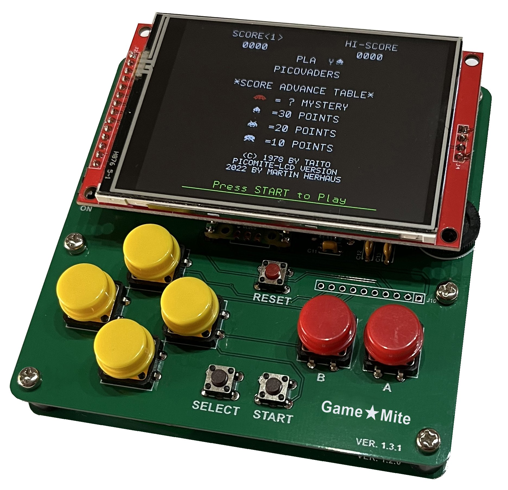
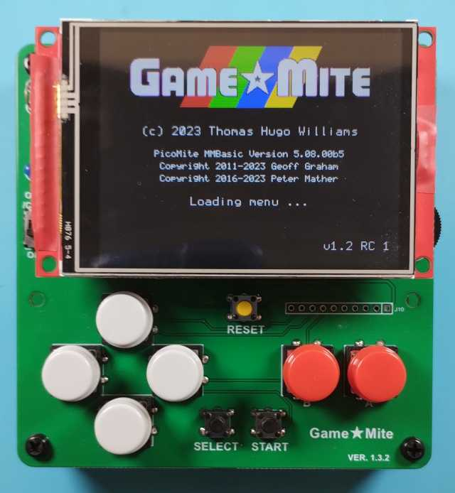
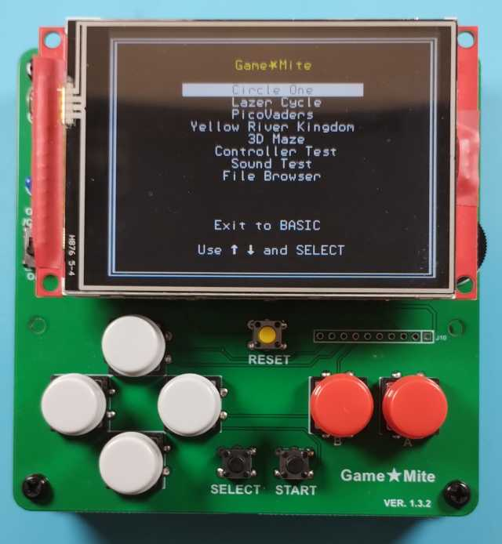
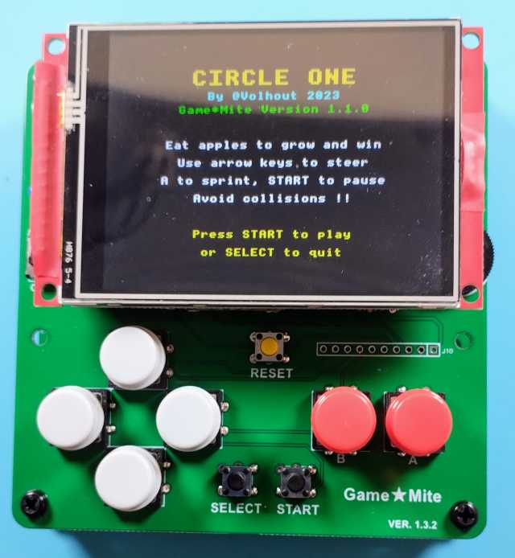
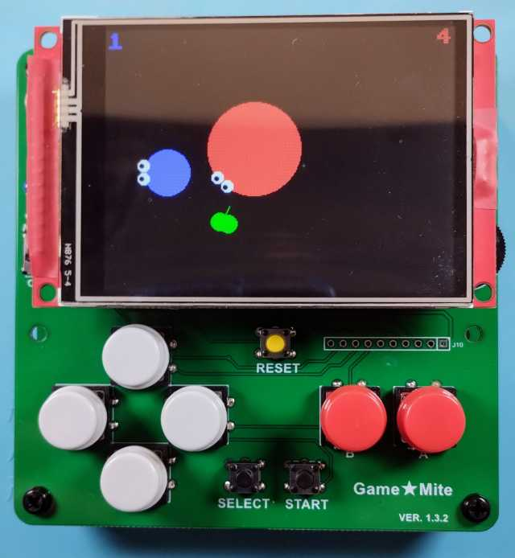
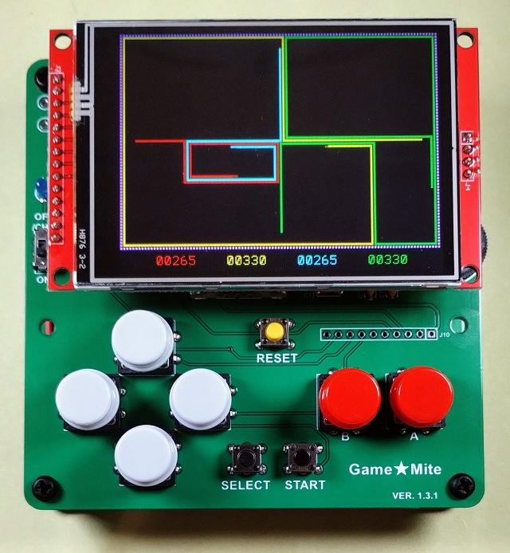
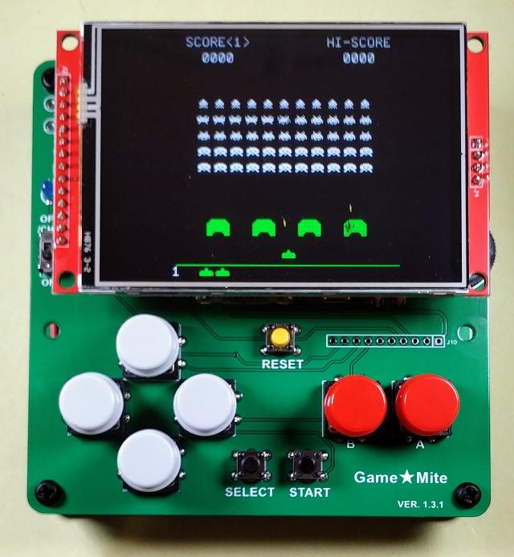
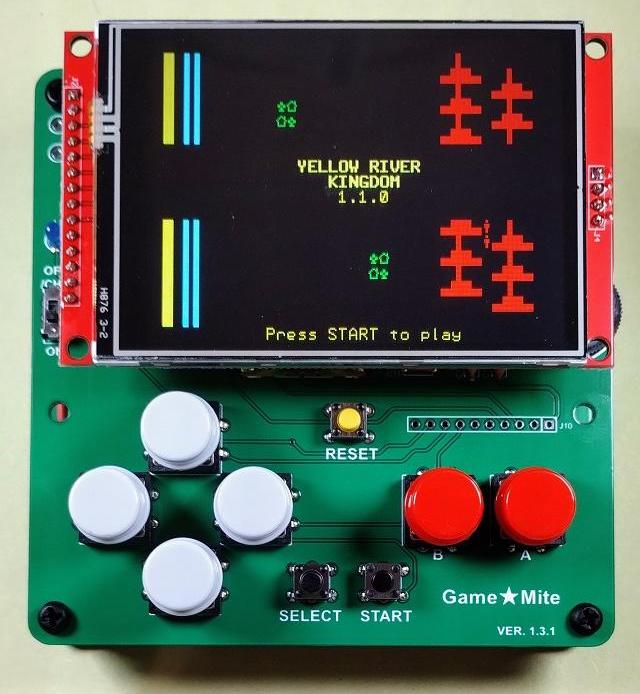
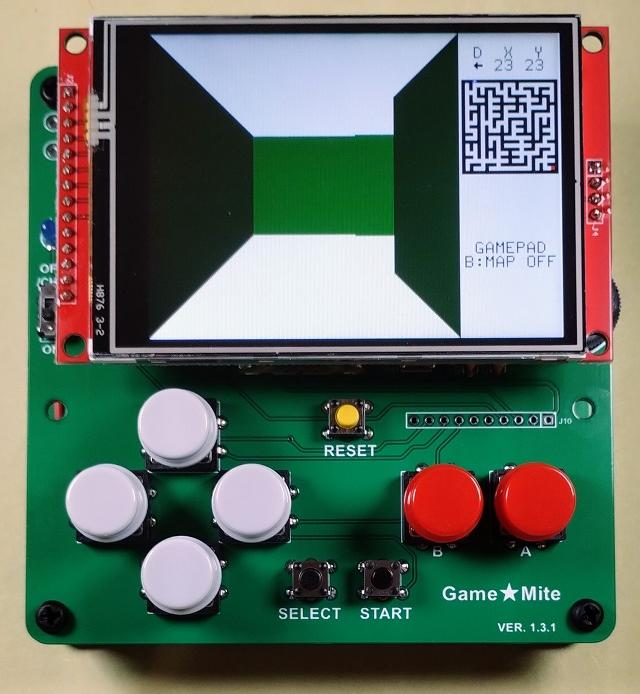
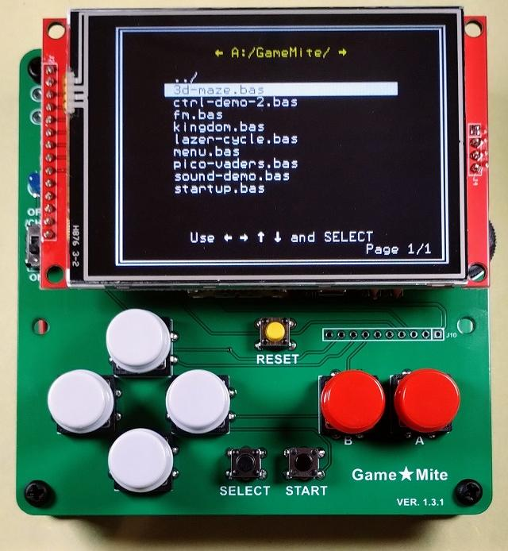

# Game★Mite

The Game★Mite is a “build it yourself” handheld game console based on the Raspberry Pi Pico microcontroller running the [PicoMite](https://geoffg.net/picomite.html) firmware.

## Features

 - Raspberry Pi Pico Microcontroller
 - 320x240 ILI9341 SPI TFT display + integrated SD card reader
 - NES style game controller (very clicky)
 - Mono audio via PWM capable of playing 4 notes simultaneously
 - 3v7 LiPo battery with charging and protection circuit
 - MMBasic programming language

## Photos

 
 
 
  

## YouTube video

&nbsp;&nbsp;&nbsp;&nbsp;

 - [Video of the release version](https://www.youtube.com/watch?v=8bx2vpwuXoo)
 - [Video of the Mark-I prototype](https://www.youtube.com/watch?v=jB5hF2ZWHrA)

## Copyright and Acknowledgements

Game★Mite hardware © 2023-2024 Thomas Hugo Williams (@thwill):
 * Original concept and prototype by Thomas Hugo Williams based on the “PicoMite Backpack” by Mick Ames (@Mixtel90).
 * PCB designed by Mick Gulovsen (@bigmik) hindered by Thomas Hugo Williams and Bill McKinley (@Turbo46).
 * Published under the CC BY 4.0 license.
 * https://www.sockpuppetstudios.com

Game★Mite software by Thomas Hugo Williams and friends:
 * See individual programs for copyright and licensing specifics.

Game★Mite User Manual © 2023-2024 Thomas Hugo Williams, Mick Gulovsen and Bill McKinley
 * Published under the CC BY 4.0 license.
 * The instructions for loading the firmware and attaching a terminal emulator were adapted with permission from the PicoMite User Manual: https://geoffg.net/Downloads/picomite/PicoMite_User_Manual.pdf.

PicoMite firmware:
 * https://geoffg.net/picomite.html
 * Copyright 2011-2024 Geoff Graham
 * Copyright 2016-2024 Peter Mather

Special thanks to @Martin H, @Mozzie, @Volhout and our other friends from https://www.thebackshed.com/forum/Microcontrollers.

## Documentation

 * [Game★Mite User Manual](doc/GameMite-User-Manual-latest.pdf) - includes build instructions
 * [PicoMite User Manual](https://geoffg.net/Downloads/picomite/PicoMite_User_Manual.pdf) - includes MMBasic programming manual

## Hardware

 * [Schematic](hardware/pcb-1-3-2/gamemite-schematic-1-3-2.jpg)
 * [PCB Gerbers](hardware/pcb-1-3-2/gamemite-gerbers-1-3-2.zip)

## Firmware and Software

 * Standard installation:
     * [GameMite-1.2-RC-2.uf2.zip](https://github.com/thwill1000/mmbasic-gamemite/releases/download/v1.2-RC-2/GameMite-1.2-RC-2.uf2.zip) - Preconfigured PicoMite firmware & Game★Mite software image

 * Alternative installation:
     * [PicoMiteV5.08.00b5.uf2.zip](https://github.com/thwill1000/mmbasic-gamemite/releases/download/v1.2-RC-2/PicoMiteV5.08.00b5.uf2.zip) - Standard firmware only PicoMite image
     * [GameMite-1.2-RC-2-alternative.zip](https://github.com/thwill1000/mmbasic-gamemite/releases/download/v1.2-RC-2/GameMite-1.2-RC-2-alternative.zip) - Game★Mite software

 * Source code for the Game★Mite software:
     * [Game★Mite system software](software/src) - menu, file browser and utilities by Thomas Hugo Williams
     * [Circle One](https://github.com/thwill1000/mmbasic-third-party/tree/main/circle) - original game by @Volhout
     * [Lazer Cycle](https://github.com/thwill1000/mmbasic-lazer-cycle) - Tron/Light Cycle clone by Thomas Hugo Williams
     * [PicoVaders](https://github.com/thwill1000/mmbasic-third-party/tree/main/pico-vaders) - Space Invaders clone by Martin Herhaus
     * [Yellow River Kingdom](https://github.com/thwill1000/mmbasic-kingdom) - simple strategy / resource management game by Tom Hartley, Jerry Temple-Fry and Richard G Warner
     * [3D Maze](https://github.com/thwill1000/mmbasic-third-party/tree/main/3d-maze) - game by by Martin Herhaus

## Other programs to download and try

 * [Blocks](https://github.com/thwill1000/mmbasic-third-party/tree/main/pico-blocks) - Tetris clone by Geoff Graham
 * [Flappy Bird](https://github.com/thwill1000/mmbasic-third-party/tree/main/flappy) - Flappy Bird clone by @Volhout
 * [PicoMan](https://github.com/thwill1000/mmbasic-third-party/tree/main/pico-man) - Pac-Man clone by Geoff Graham
 * [Snake](https://github.com/thwill1000/mmbasic-third-party/tree/main/snake) - obligatory "Snake" game by @Volhout

## FAQ

**1. What is a PicoMite ?**

The PicoMite is a Raspberry Pi Pico running the free MMBasic interpreter.

MMBasic is a Microsoft BASIC compatible implementation of the BASIC language with floating point, integer and string variables, arrays, long variable names, a built in program editor and many other features.

Using MMBasic you can use communications protocols such as I2C or SPI to get data from a variety of sensors. You can save data to an SD card, display information on colour LCD displays, measure voltages, detect digital inputs and drive output pins to turn on lights, relays, etc. All from inside this low cost microcontroller.

The PicoMite firmware is totally free to download and use.

More information can be found on the official PicoMite website at https://geoffg.net/picomite.html

**2. What happened to the custom Game★Mite firmware ?**

This was only required for Game★Mite 1.0.0 & 1.1.0:
 - The customisations were only very minor.
 - Peter Mather has since incorporated them into the standard PicoMite 5.08 firmware.
 - For historical reference the source of the now-outdated custom firmware is [here](https://github.com/thwill1000/picomite-firmware/tree/gamemite).

**3. How do I contact the creator of the Game★Mite ?**

I can be contacted via:
 - https://github.com as user "thwill1000"
 - https://www.thebackshed.com/forum/Microcontrollers as user "thwill"

##

The Game★Mite design, gerbers, PicoMite firmware and Game★Mite software are distributed for free but if you enjoy it then perhaps you would like to buy me a coffee?

