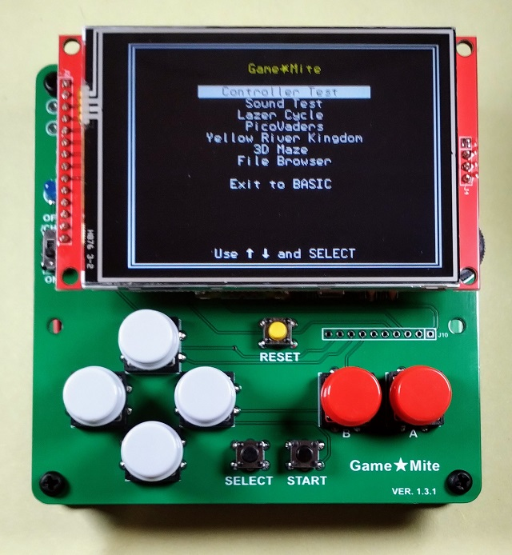

# Game★Mite

The GameMite is a “build it yourself” handheld game console based on the Raspberry Pi Pico microcontroller running a customised version of the [PicoMite](https://geoffg.net/picomite.html) firmware.

## Features

 - Raspberry Pi Pico Microcontroller
 - 320x240 ILI9341 SPI TFT display + integrated SD card reader
 - NES style game controller (very clicky)
 - Mono audio via PWM capable of playing 4 notes simultaneously
 - 3v7 LiPo battery with charging and protection circuit
 - MMBasic programming language

## Photos

  
  

## YouTube video

This video shows the Mark-I prototype.

&nbsp;&nbsp;&nbsp;&nbsp;

*Video of the release version coming soon-ish*.

## Copyright and Acknowledgements

GameMite hardware © 2023 Thomas Hugo Williams (@thwill):
 * Original concept and prototype by Thomas Hugo Williams based on the “PicoMite Backpack” by Mick Ames (@Mixtel90).
 * PCB designed by Mick Gulovsen (@bigmik) hindered by Thomas Hugo Williams and Bill McKinley (@Turbo46).
 * Published under the CC BY 4.0 license.
 * https://www.sockpuppetstudios.com

GameMite MMBasic program suite by Thomas Hugo Williams and friends:
 * See individual programs for copyright and licensing specifics.

GameMite User Manual © 2023 Thomas Hugo Williams, Mick Gulovsen and Bill McKinley
 * Published under the CC BY 4.0 license.
 * The instructions for loading the firmware and attaching a terminal emulator were adapted with permission from the PicoMite User Manual: https://geoffg.net/Downloads/picomite/PicoMite_User_Manual.pdf.

PicoMite/MMBasic firmware:
 * https://geoffg.net/picomite.html
 * Copyright 2011-2023 Geoff Graham
 * Copyright 2016-2023 Peter Mather
 * Customisations for GameMite by Thomas Hugo Williams - https://github.com/thwill1000/picomite-firmware/tree/gamemite.

Special thanks to @Martin H, @Mozzie, @Volhout and our other friends from https://www.thebackshed.com/forum/Microcontrollers.

## Documentation

 * [User Manual](doc/GameMite-User-Manual-latest.pdf)

## Hardware

 * [Schematic](hardware/pcb-1-3-2/gamemite-schematic-1-3-2.jpg)
 * [PCB Gerbers](hardware/pcb-1-3-2/gamemite-gerbers-1-3-2.zip)

## Firmware & Software

 * Installations:
     * [GameMite-1.1.0-full.zip](download/GameMite-1.1.0-full.zip) - Standard installation
     * [GameMite-1.1.0-appendix-d.zip](download/GameMite-1.1.0-appendix-d.zip) - Alternative "Appendix D" installation
 * Source code:
     * [Customised version of PicoMite firmware](https://github.com/thwill1000/picomite-firmware/tree/gamemite) - by Geoff Graham, Peter Mather and Thomas Hugo Williams
     * [GameMite "system" programs](software/src) - by Thomas Hugo Williams
     * [Lazer Cycle](https://github.com/thwill1000/mmbasic-lazer-cycle) - by Thomas Hugo Williams
     * [PicoVaders](https://github.com/thwill1000/mmbasic-third-party/tree/main/pico-vaders) - by Martin Herhaus
     * [Yellow River Kingdom](https://github.com/thwill1000/mmbasic-kingdom) - by Tom Hartley, Jerry Temple-Fry and Richard G Warner
     * [3D Maze](https://github.com/thwill1000/mmbasic-third-party/tree/main/3d-maze) - by Martin Herhaus

## Other programs to download and try

 * [Snake](https://github.com/thwill1000/mmbasic-third-party/tree/main/snake) - game by @Volhout
 * [Circle](https://github.com/thwill1000/mmbasic-third-party/tree/main/circle) - game by @Volhout 

## FAQ

**1. What is a PicoMite ?**

The PicoMite is a Raspberry Pi Pico running the free MMBasic interpreter.

MMBasic is a Microsoft BASIC compatible implementation of the BASIC language with floating point, integer and string variables, arrays, long variable names, a built in program editor and many other features.

Using MMBasic you can use communications protocols such as I2C or SPI to get data from a variety of sensors. You can save data to an SD card, display information on colour LCD displays, measure voltages, detect digital inputs and drive output pins to turn on lights, relays, etc. All from inside this low cost microcontroller.

The PicoMite firmware is totally free to download and use.

More information can be found on the official PicoMite website at https://geoffg.net/picomite.html

**2. How do I contact the creator of the GameMite ?**

I can be contacted via:
 - https://github.com as user "thwill1000"
 - https://www.thebackshed.com/forum/Microcontrollers as user "thwill"

##

The GameMite design, gerbers, firmware and MMBasic program suite are distributed for free but if you enjoy it then
perhaps you would like to buy me a coffee?

