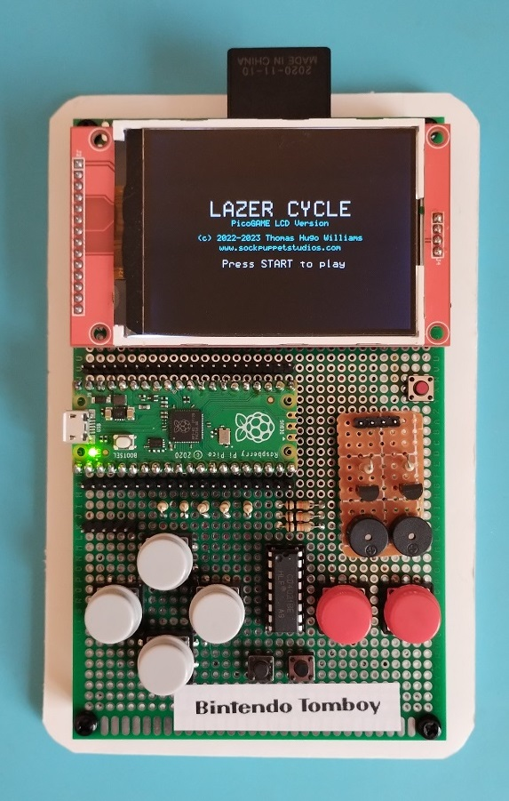
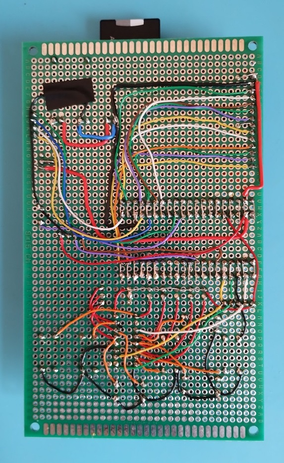

# PicoGAME LCD

The "PicoGAME LCD" is a handheld videogame based on the Raspberry Pico microcontroller running the [PicoMite](https://geoffg.net/picomite.html) firmware.

**Features:**

 - Raspberry Pico Microcontroller
 - 320x240 ILI9341 SPI LCD display + integrated SD card reader
 - NES style game controller (very clicky)
 - Two channel audio (that sounds like an irate hornet)
 - 3.7V LIPO battery with charging and protection circuit
 - MMBasic programming language

**Photos of the Mk-I:**

 

**YouTube video:**

&nbsp;&nbsp;&nbsp;&nbsp;<a href="https://www.youtube.com/watch?v=jB5hF2ZWHrA"></a>

**Credits:**

 * PicoGAME LCD concept, prototype and software by Thomas Hugo Williams (@thwill)
 * Based on the "PicoMite Backpack" by @Mixtel90
 * PicoMite MMBasic:
     * Copyright 2011-2023 Geoff Graham
     * Copyright 2016-2023 Peter Mather
 * With thanks to @bigmik, @Turbo46 and @Volhout

## Hardware

 * [Schematic](hardware/pico-game-lcd-mk1/pico-game-lcd-mk1-schematic-0.1.2.pdf)
 * *PCB coming (not very) soon ... hopefully*

## Firmware

The PicoGAME LCD uses a customised version of the latest beta PicoMite/MMBasic firmware:
 * [PicoMite-pglcd-0.2.0.zip](https://github.com/thwill1000/pico-game-lcd/raw/develop/0.2.0/download/PicoMite-pglcd-0.2.0.zip) - derived from PicoMite 5.07.08b11
     * Copyright 2011-2023 Geoff Graham
     * Copyright 2016-2023 Peter Mather

Instructions for installing/updating the PicoMite firmware on a Raspberry Pico can be found in the **Getting Started** chapter of the [PicoMite User Manual](https://geoffg.net/Downloads/picomite/PicoMite_User_Manual.pdf).

Once the firmware is installed and the green "heartbeat" LED on the PicoMite is flashing, use a USB data cable and a terminal program running on a "PC" to connect to the PicoGAME LCD as described in the **Getting Started** chapter of the PicoMite User Manual.

Run the following commands at the MMBasic prompt to configure the system options for the PicoGAME LCD:
 ```
 OPTION CPUSPEED 252000
 OPTION SYSTEM SPI GP6,GP3,GP4
 OPTION TOUCH GP5,GP7
 OPTION SDCARD GP22
 OPTION AUDIO GP20,GP21
 OPTION LCDPANEL ILI9341,RLANDSCAPE,GP2,GP1,GP0
 ```

### Differences from the standard PicoMite firmware

The PicoGAME LCD firmware differs from the standard PicoMite firmware in the following ways:
 - If a "sigbus" error occurs it does not clear `OPTION AUTORUN`.
     - The standard PicoMite does this to prevent the Pico going into an unbreakable restart cycle should the program being `AUTORUN` throw such an error; the simple PicoGAME LCD "startup.bas" is hopefully error free.
     -  Without this modification any "sigbus" error thrown will cause the PicoGAME LCD to reboot to a blank display that can only be restored by attaching a serial console and re-enabling `OPTION AUTORUN` as described in [Software](README.md#Software) below.

 - If `OPTION LCDPANEL CONSOLE` is not set (the default) then the PicoGAME LCD will display any uncaught error on the LCD panel as well as the serial console.
     - Without this modification any uncaught error will cause the PicoGAME LCD to appear to have hung; the fact that an error had occurred would only be visible on the serial console.

NOTE: The current iteration of the PicoGAME LCD will also work with the standard PicoMite 5.07.08b8 (or later) firmware subject to the limitations addressed above.

## Software

The standard PicoGAME LCD software pack can be downloaded from:
 *  [pglcd-0.2.0.zip](https://github.com/thwill1000/pico-game-lcd/raw/develop/0.2.0/download/pglcd-0.2.0.zip)

To install it on the PicoMite internal flash drive (A:/):
 1. Extract contents of zip file into the root of a FAT32 formatted SD card.
     * Once extracted the SD card should contain the following:
         ```
         /
             pglcd/
                 install-a.bas
                 menu.bas
                 startup.bas
                 ...
         ```
     * *NB: the SD card may have other pre-existing content, but only the "pglcd/" directory is revelvant to these installation instructions.*

  2. Connect to the PicoGAME LCD from a terminal emulator as described in the **Getting Started** chapter of the PicoMite User Manual.
  3. Insert the SD card into the PicoGAME LCD.
  4. Run the following command at the MMBasic prompt to copy the software to the A:/ drive:
      ```
      RUN "B:/pglcd/install-a.bas"
      ```
  5. When this has completed RUN the following commands to complete setup:
      ```
      FLASH ERASE 1
      LOAD "A:/pglcd/startup.bas"
      FLASH SAVE 1
      OPTION AUTORUN 1
      ```
     *NB: `FLASH ERASE 1` will report a harmless error if flash slot 1 is already empty.*

The PicoGAME LCD software should now be setup. If RESET is pressed or the device is power-cycled it should reboot to show the version and copyright message before displaying the main-menu.

## FAQ

**1. What is a PicoMite ?**

The PicoMite is a Raspberry Pi Pico running the free MMBasic interpreter.

MMBasic is a Microsoft BASIC compatible implementation of the BASIC language with floating point, integer and string variables, arrays, long variable names, a built in program editor and many other features.

Using MMBasic you can use communications protocols such as I2C or SPI to get data from a variety of sensors. You can save data to an SD card, display information on colour LCD displays, measure voltages, detect digital inputs and drive output pins to turn on lights, relays, etc. All from inside this low cost microcontroller.

The PicoMite firmware is totally free to download and use.

More information can be found on the official PicoMite website at https://geoffg.net/picomite.html

**2. How do I contact the creator of the PicoGAME LCD ?**

I can be contacted via:
 - https://github.com as user "thwill1000"
 - https://www.thebackshed.com/forum/ViewForum.php?FID=16 as user "thwill"

##

The PicoGAME LCD schematic and games are distributed for free but if you enjoy it then
perhaps you would like to buy me a coffee?

<a href="https://www.buymeacoffee.com/thwill"></a>
